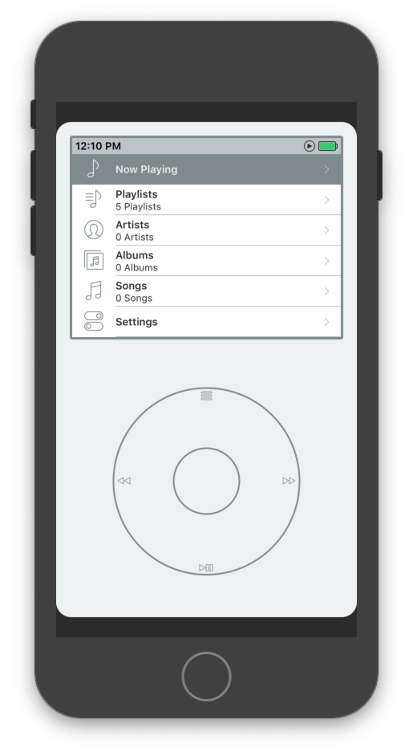

# iClassic

## About
iClassic is an iPod classic simulator for the iPhone, it's goal is to recreate the feel of the iPod, but it's not supposed to be a perfect recreation.

It supports all iPhone models.

This would be iClassic 3. iClassic 1 was the original, iClassic 2 was the last version to be on Cydia.

Let me know on Twitter ([@EmilioPelaez](https://twitter.com/EmilioPelaez)) when you install it, I'd love to hear about it.
If you love iClassic and want to buy me a beer, [you can do it here](https://paypal.me/EmilioPelaez).

## Installation
### Jailbroken Device
- Go to the [Releases](https://github.com/EmilioPelaez/iClassic/releases) page and download the ipa file
- Install using [Impactor](http://www.cydiaimpactor.com)

### Non Jailbroken Device (Requires Xcode)
- Download and install Xcode.
- Download project.
- Open workspace file in Xcode.
- Install to your device.
- Google "install app from Xcode" because I'm probably missing a few steps.

## Code Considerations
The code is petty old, some of it dates back to 2009. I've learned a **lot** in these 9 years, and I like to think that the code I write now is a lot better, but the code in iClassic is surprisingly solid.

A few years ago I updated it to use storyboards, it's all in one big storyboard, it's annoying, sorry about that.

## Q&A
- Why did it take you so long to release this?
I kept forgetting about it.
- Why isn't iClassic on the App Store?
Apple won't allow it.
- I purchased iClassic seven years ago and now it's free, can I get a refund?
No.

## Contributing
If you really feel like contributing go ahead and open a Pull Request. Tweet at me [@EmilioPelaez](https://twitter.com/EmilioPelaez) if I take too long to respond, I might miss the GitHub notification.

There are some things I think could be improved below.

## Known Issues
- Scrolling speed when scrolling through a long list could be improved. (Hard difficulty)
- Now Playing cell in main display won't update when the song changes. (Easy difficulty)
- Volume can't be changed from the now playing display. Apple deprecated that API when they introduced the volume bar view. It also used to show the volume HUD, which is why I disabled that.
- Sometimes the play icon in the status bar gets out of sync. (Medium difficulty)
- Scrolling through a long list doesn't show a HUD (Medium difficulty)
- The current icon is lame. I made it in 5 minutes in Pixelmator. (SUPER EXTRA HARD difficulty, unless you're a designer)

## License
I'm releasing this under the MIT License. Feel free to modify it, play with it, install it on your device, your friends' or your parents'.
If you want to distribute it through a service like Cydia, let me know and I'll try to work something out.
